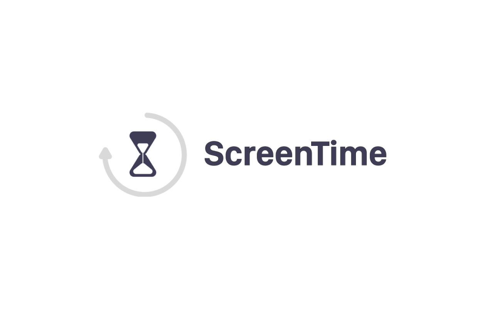
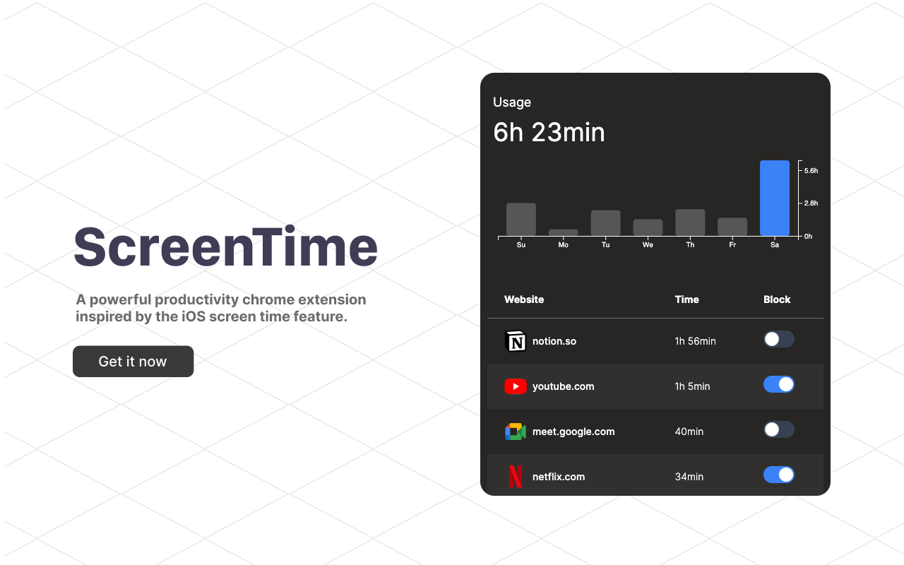

## ScreenTime

Introducing the ScreenTime Chrome Extension

ScreenTime is a powerful Chrome extension designed to help you stay focused and productive by tracking your web usage and providing insights into your online habits. Inspired by the popular iOS Screen Time feature, this intuitive and user-friendly extension keeps you accountable for your time spent on websites, allowing you to take control of your digital life.

Key Features:
- Daily Usage History: Tracks your web usage on a daily basis.
- Weekly Graph: Visualizes your web usage trends over a week.
- Website Blocker: Allows you to block specific websites to eliminate distractions.

    
    
    

